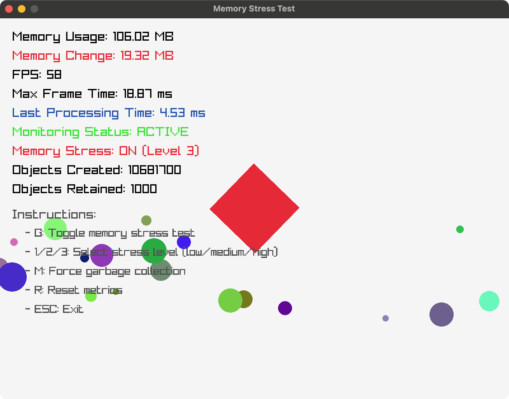

# Racket Raylib Memory Stress Test (for checking GC stop-the-world pauses)



- **NOTE**: Why using raylib is just to visualize (and experience it in realtime) the stop-the-world. Not intended specific test for raylib, just for general memory stress test and GC stop-the-world confirmation on Racket-lang.

- **WARNING**: Previously, output had estimated GC stats, but there were incorrect values ([Issue #1](https://github.com/funatsufumiya/racket-raylib-memory-stress-test/issues/1)). So now it was removed. Please check memory consumption and lag by your own eyes.

## Prerequisites

```bash
$ raco pkg install raylib
```

## Usage

```bash
$ racket memory-stress-test-raylib.rkt
``` 

## Rust code for comparison

You can run nearly the same code in Rust version:

```bash
$ cd rust-memory-stress-test
$ cargo run

# Recommend: clean the project after run. 
# ( Because intermediate files will be GBs class size. )
$ cargo clean
```

(Visual result was almost the same between Racket and Rust, in my environment M1 MacBook Air.)

## Appendix1: Object Stress Test


This is for checking how many objects can be visualized in realtime in Raylib.

```bash
$ racket object-stress-test-raylib.rkt
```

### Rust version

```bash
$ cd rust-object-stress-test
$ cargo run
$ cargo clean
```

(Stress result was almost the same between Racket and Rust, in my environment M1 MacBook Air.)

## Appendix2: Memory Consumption Benchmark (Racket vs SBCL)

This appendix compares memory usage patterns between Racket and SBCL (Common Lisp) using both computational (tak function) and memory-intensive allocation tests.

### Usage

Racket benchmark:
```bash
$ racket bench-tak.rkt
```

SBCL benchmark:
```bash
$ sbcl --load bench-tak.lisp
```

### Results (Measured on M1 MacBook Air)

| Measurement | Racket | SBCL |
|-------------|--------|------|
| Baseline memory | 66.08 MB | 37.06 MB |
| Memory increase after tak function | +0.09 MB | +0.00 MB |
| Final memory increase after allocation test | +0.41 MB | +0.07 MB |

Both implementations successfully managed large temporary allocations (~76MB) with minimal permanent memory growth. The GC monitor tool confirmed that Racket performs garbage collection without observable pauses during interactive use.

## Acknowledgement

This project, including both the code and documentation (including English translation), was developed with the assistance of an AI coding assistant (Cody).
